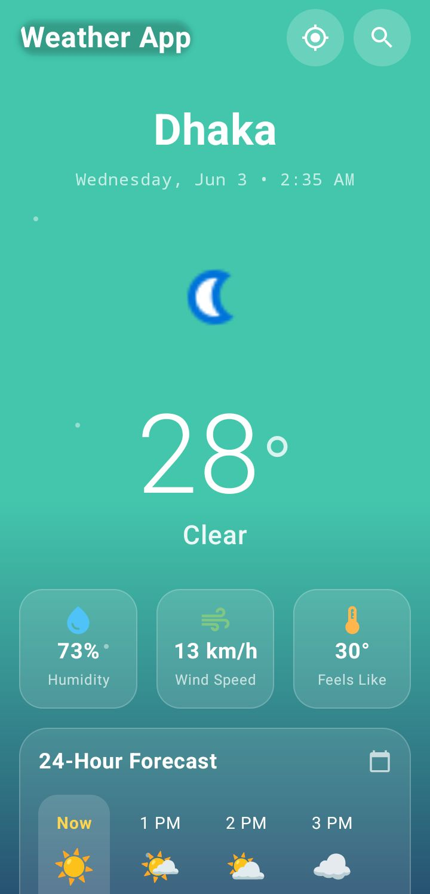
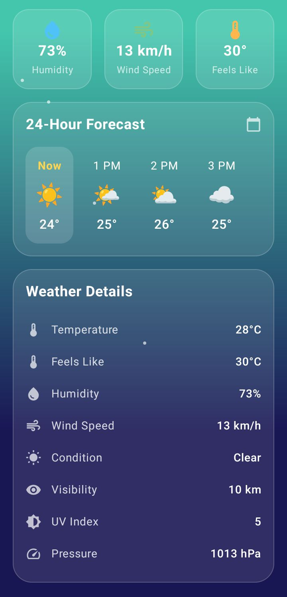
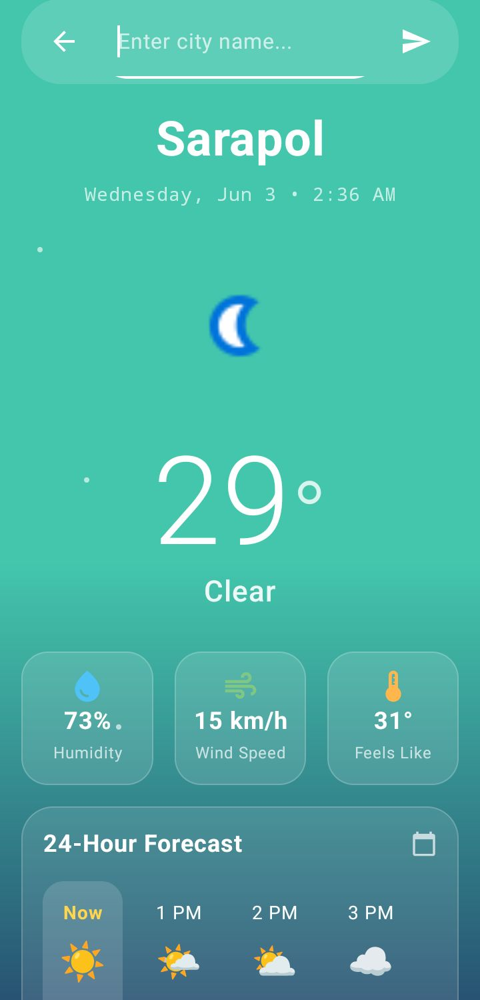

# 🌤️ Weather App

**A modern weather application built with Jetpack Compose**

## 📱 Features

- 🌍 Current location weather
- 🔍 City search
- 🌡️ Real-time data
- 📊 24-hour forecast

## 📸 Screenshots

## Sample Data

| Location | Temperature | Condition |
|----------|-------------|-----------|
| Dhaka | 28°C | Clear |
| Sarapol | 29°C | Clear |

## Tech Stack

- Kotlin + Jetpack Compose
- MVVM Architecture
- Retrofit + WeatherAPI.com

## Installation

1. Clone: `https://github.com/Neloy007/WeatherAppAtmos.git`
2. Get API key from weatherapi.com
3. Add to WeatherViewModel.kt
4. Build and run

## License

MIT
